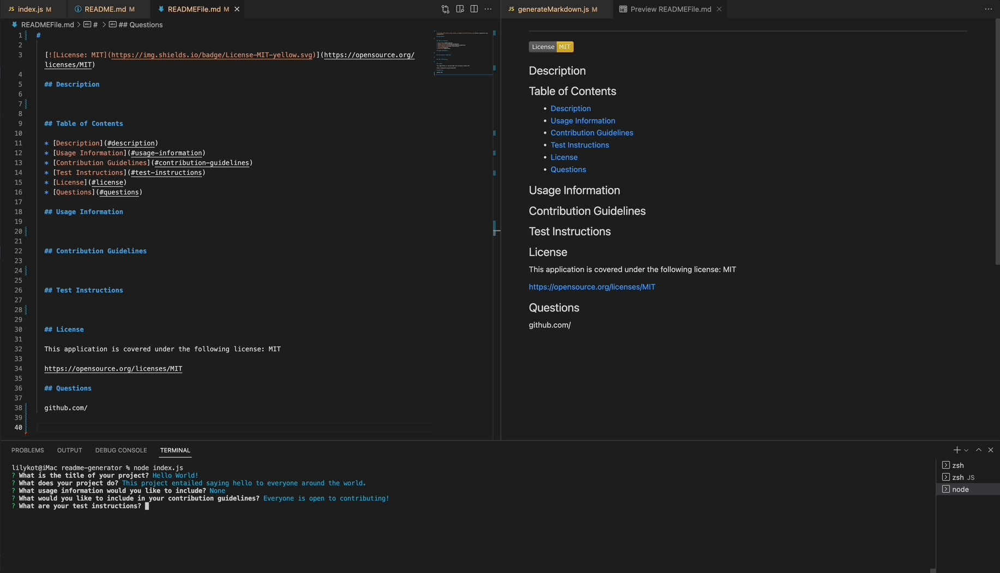
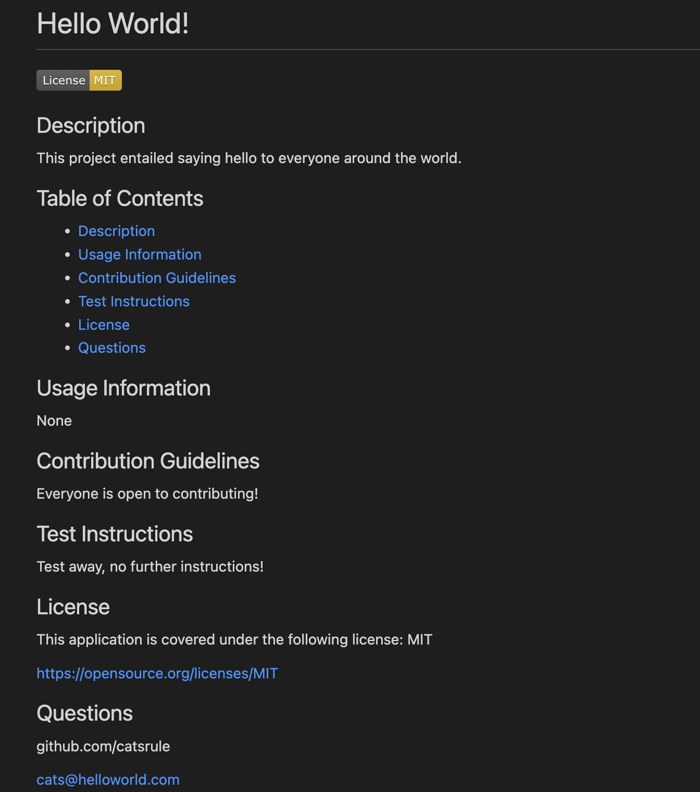

# Personal Readme Generator

## Project Summary

The following project entailed creating a [command-line application](https://github.com/lilyannekot/readme-generator) that quickly and easily generates a [ready-to-use README file](https://drive.google.com/file/d/1vnbIEl9RdzTYh6wyFDLlV2OB1G2BtnQK/view?usp=sharing). 

## Table of Contents

* [Languages and Technolog Used](#languages-and-technology-used)
* [Project Demonstration](#project-demonstration)
* [Generated README Screenshot](#generated-readme-screenshot)
* [Code Snippet](#code-snippet)
* [Author Links](#author-links)

## Languages and Technology Used

* Javascript
* Node.js

## Project Demonstration



## Generated README Screenshot



## Code Snippet

The code presented below is used to loop through an object of license options and return the license badge within the README if the selected license is found within the object. If a user choosed "No License," no badge will appear within the readme at the top and the "License" section will remain empty.

```
function renderLicenseBadge(license) {
  if (license in licenseOptions === true) {
    console.log(license);
    return licenseBadge[license]
  } else {
    return ''
  };
};

```

The badge is rendered at the top of the page through the following function:
```
function generateMarkdown(responses) {

...

${renderLicenseBadge(responses.license)}

```

## Author Links 

* [GitHub](https://github.com/lilyannekot)
* [Project Website](https://github.com/lilyannekot/readme-generator)
* [Project Demonstration Video](https://drive.google.com/file/d/1vnbIEl9RdzTYh6wyFDLlV2OB1G2BtnQK/view?usp=sharing)
* [LinkedIn](https://www.linkedin.com/in/lilykot/)